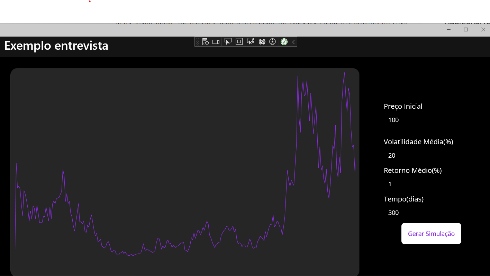

# Desafio Simulaçdor de Preços Movimento Browniano .NET MAUI

# Informações sobre o projeto
> Aplicação Windows Desktop Uitlizando tecnologia MAUI com a versão 7 do .NET fazendo uso do padrão MVVM e Clean Code.
> Esta aplicação gera uma simulação de preços com base no movimento browniano e desenha um gráfico ao clicar no botão [ Gerar Simulação ], fazendo uso do IDrawable.
